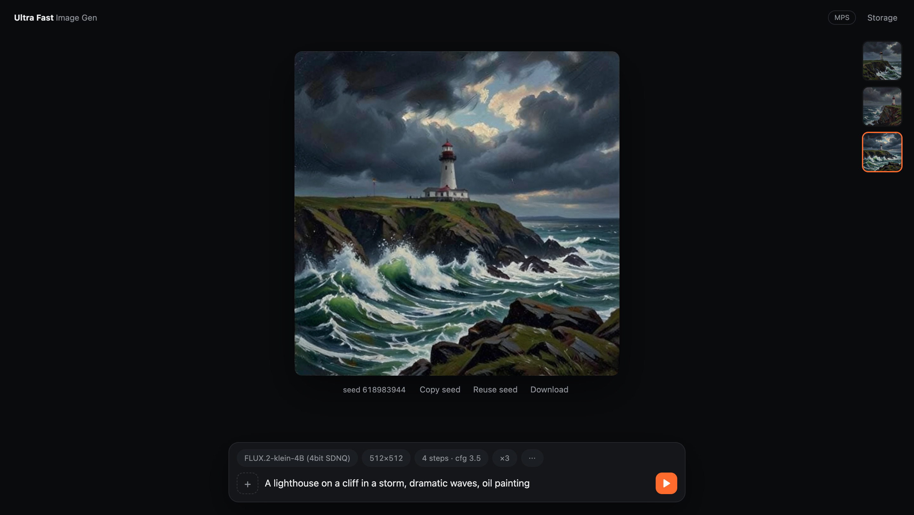

# Ultra Fast Image Gen

AI image generation and editing on Mac Silicon and CUDA. Generate images from text or transform existing images with state-of-the-art diffusion models.



## Features

- **Image Generation:** Create images from text prompts
- **Image Editing:** Upload up to 6 reference images and transform them with natural language
- **Multiple Models:** FLUX.2-klein and Z-Image Turbo
- **Quantized Models:** Low memory usage with 4bit/int8 quantization
- **Anima Turbo AIO:** Local patched Metal runner with Turbo LoRA baked into the GGUF
- **Uncensored FLUX.2 2K lanes:** MFLUX/MLX fast path and PyTorch SDNQ fallback with MPS optimizations
- **Bonsai Image 4B:** Ternary FLUX.2 Klein, in-process MLX on Apple Silicon
- **LoRA Support:** Load custom LoRA adapters with Z-Image Full model
- **Cross-Platform:** Apple Silicon (MPS) and NVIDIA GPUs (CUDA)

## Supported Models

| Model | VRAM | Features | Speed |
|-------|------|----------|-------|
| FLUX.2-klein-4B Uncensored MFLUX HS | ~7GB RSS @ 2K | Text-to-image, uncensored GGUF TE, validated to 2K | Fastest current 2K FLUX lane |
| FLUX.2-klein-4B Uncensored SDNQ HS | ~8GB MPS / low RAM @ 2K | Text-to-image, uncensored GGUF TE, exact chunked MPS attention + HS | PyTorch 2K fallback |
| FLUX.2-klein-4B (4bit SDNQ) | <8GB @ 512px, <16GB @ 1024px | Text-to-image + Image editing | Fast |
| FLUX.2-klein-9B (4bit SDNQ) | ~12GB @ 512px, ~20GB @ 1024px | Text-to-image + Image editing (Higher Quality) | Fast |
| FLUX.2-klein-4B (Int8) | ~16GB | Text-to-image + Image editing | Fast |
| Z-Image Turbo (Quantized) | ~8GB | Text-to-image | Fastest |
| Anima Turbo AIO Q4 (Metal) | ~3GB model + unified memory | Text-to-image, baked Turbo LoRA | ~16s internal @ 512x768 / 8 steps |
| Bonsai Image 4B (Ternary MLX) | ~3.7GB, Apple Silicon only | Text-to-image, 4 steps | ~15s @ 512x512 / 4 steps |
| Z-Image Turbo (Full) | ~24GB | Text-to-image + LoRA | Slower |

The uncensored variants do not re-download a separate base model: the SDNQ HS
lane and the plain uncensored model reuse the FLUX.2-klein-4B (4bit SDNQ)
backbone, so the only extra download is the uncensored Qwen3 text encoder
(~2.5GB GGUF at the default `q4_k_m` quant).

> **Note:** the [uncensored text encoder repo](https://huggingface.co/ponpoke/flux2-klein-4b-uncensored-text-encoder)
> is gated on Hugging Face (instant auto-approval). Accept the terms on the
> model page once, then paste a token in the app's **⋯ menu** (it's validated
> and stored in `.env` for you — or create `.env` yourself with `HF_TOKEN=hf_...`).

## Quick Start (1-Click)

1. Download/clone the repo
2. **Double-click `Launch.command`**
   (if macOS says it's from an unidentified developer, right-click the file → Open → Open)
3. First run will auto-install dependencies (~5 min); later runs reinstall if `requirements.txt` changed
4. The launcher installs/builds the patched Anima Metal runner and the MFLUX 2K runtime if needed — if either fails, the app still starts and the rest of the models work
5. Browser opens automatically to the UI
6. Models download from inside the app: each one in the model picker has a Download button with live progress (or they fetch automatically on first generate)
7. For the Uncensored models, paste your Hugging Face token in the **⋯ menu** (gated text encoder — accept the terms on the model page once)

> Bonsai Image 4B is **not** part of this default install — it's an opt-in extra
> (`uv sync --extra bonsai`, Apple Silicon + python 3.11+). See
> [Bonsai Image 4B (optional)](#bonsai-image-4b-optional).

## Manual Installation

```bash
git clone https://github.com/newideas99/ultra-fast-image-gen.git
cd ultra-fast-image-gen

python3.11 -m venv venv
source venv/bin/activate

pip install -r requirements.txt

# For the uncensored models (gated text-encoder repo):
echo "HF_TOKEN=hf_your_token_here" > .env
```

### Anima Fresh Install

`Launch.command` runs this automatically when the Anima runner is missing:

```bash
scripts/setup_anima_metal_runner.sh
```

The setup script clones `stable-diffusion.cpp`, checks out the tested revision,
applies the bundled ggml Metal patch for Anima VAE ops, builds `sd-cli` with
Metal enabled, and writes `~/anima-comfyui/run_anima_aio_metal.sh`.

The downloaded `Anima-P3-Turbo-AIO-Q4_K.gguf` already has the Anima Turbo LoRA
merged in. The app does not need a separate `anima-turbo-lora-v0.1.safetensors`
file for this model.

### MFLUX HS 2K Lane Fresh Install

`Launch.command` runs this automatically when the MFLUX runtime is missing:

```bash
scripts/setup_mflux_hs.sh
```

The setup script clones [mflux](https://github.com/filipstrand/mflux) at the
tested 0.17.5 revision into `~/.cache/ultra-fast-image-gen/mflux`, applies the
bundled hidden-state-compression + uncensored-GGUF-text-encoder patch
(`patches/mflux_hs_uncensored_gguf.patch`), and pre-builds the `uv`
environment. Only the "FLUX.2-klein-4B Uncensored MFLUX HS" model needs this;
the SDNQ HS 2K lane runs on the normal Python dependencies. Override the
install location with `ULTRA_FAST_MFLUX_HS_DIR`.

### Bonsai Image 4B (optional)

Bonsai (ternary) is **not installed by default** — it's an opt-in extra. It runs
in-process on MLX and is **Apple Silicon + python 3.11+ only**. Enable it with
uv (the extra carries a `mlx` override that plain pip won't honour, so uv is
required here):

```bash
uv sync --extra bonsai
```

That pulls `prism-image-studio` + `mflux-prism` and stock `mlx` (prebuilt wheel —
no Xcode/Metal build needed). Weights (~3.7 GB) auto-download from Hugging Face
on first use.

Note: only the ternary arm is supported. The 1-bit/binary arm needed a
source-built mlx fork whose Metal kernels don't compile on current macOS, so
it's dropped — ternary uses standard 2-bit affine quant on stock mlx instead.

## Usage

### Web UI

```bash
python server.py
```

Then open http://localhost:7860 in your browser.

The UI is a dependency-free HTML/CSS/JS frontend served by a small FastAPI
backend. It shows real per-step progress, supports batch generation (up to 8
images per run), resolution presets, drag-and-drop image editing, a session
gallery, storage management, and remembers your settings between visits.

Each model in the picker has its own Download / Delete button with live
progress, so you can pre-fetch weights before generating; deleting a model
keeps any base files another downloaded model still shares. Generating with
a model you haven't downloaded also just works — the download progress shows
up in the status card first. Switching models unloads the previous one from
memory before the new one loads.

### Model Selection

- **FLUX.2-klein-4B Uncensored MFLUX HS:** Default. Fastest 2K text-to-image lane (~100s @ 2048x2048). Uses the patched MFLUX runtime (`scripts/setup_mflux_hs.sh`) plus the uncensored Qwen GGUF text encoder
- **FLUX.2-klein-4B Uncensored SDNQ HS:** PyTorch SDNQ 2K text-to-image lane with exact MPS query chunking and hidden-state compression; no extra setup
- **FLUX.2-klein-4B (4bit SDNQ):** Lowest memory, supports image editing
- **FLUX.2-klein-9B (4bit SDNQ):** Higher quality 9B model, more memory
- **FLUX.2-klein-4B (Int8):** Alternative quantization, more memory
- **Z-Image Turbo (Quantized):** Fastest text-to-image, no image editing
- **Anima Turbo AIO Q4 (Metal):** Uses `~/anima-comfyui/run_anima_aio_metal.sh`; auto-downloads the Turbo AIO GGUF if missing and defaults to 512x768, 8 steps, CFG 1
- **Bonsai Image 4B (Ternary MLX):** In-process MLX on Apple Silicon, 4-step distilled. Weights auto-download on first use (opt-in extra)
- **Z-Image Turbo (Full):** Use when you need LoRA support

### Image Editing (FLUX.2-klein)

1. Select a classic FLUX.2-klein model from the dropdown (4bit SDNQ, 9B, or Int8 — the 2K uncensored lanes are text-to-image in the UI)
2. Upload up to 6 images in the gallery
3. Write a prompt describing the changes you want
4. Select output resolution (1024px, 1280px, or 1536px)
5. Click Generate

### Command Line

Each model has its own sub-command with the options it needs:

```bash
# Z-Image Turbo (quantized) — fastest, ~3.5 GB
python generate.py zimage-quant a beautiful sunset over mountains

# Z-Image Turbo (full precision) — with optional LoRA
python generate.py zimage-full a beautiful sunset --lora my.safetensors --lora-strength 0.8

# FLUX.2-klein-4B (4bit SDNQ)
python generate.py flux2-4b-sdnq a beautiful sunset --guidance 3.5 --steps 28

# FLUX.2-klein-4B (Int8)
python generate.py flux2-4b-int8 a beautiful sunset --guidance 3.5 --steps 28

# FLUX.2-klein-9B (4bit SDNQ) — higher quality
python generate.py flux2-9b-sdnq a beautiful sunset --guidance 3.5 --steps 28

# FLUX.2-klein-4B Uncensored MFLUX/MLX HS — fastest current 2K path
python generate.py flux2-4b-uncensored-mflux-hs a beautiful sunset --width 2048 --height 2048 --steps 4

# FLUX.2-klein-4B Uncensored PyTorch SDNQ HS — optimized PyTorch/MPS 2K path
python generate.py flux2-4b-uncensored-sdnq-hs a beautiful sunset --width 2048 --height 2048 --steps 4

# Image-to-image editing (FLUX.2-klein models only)
python generate.py flux2-4b-sdnq transform the fox into a wolf --input-images ref.png

# Anima Turbo AIO (Metal runner, baked Turbo LoRA)
python generate.py anima anime portrait, detailed eyes --anima-preset Balanced

# Bonsai Image 4B ternary (MLX, Apple Silicon) — needs the bonsai extra
python generate.py bonsai-ternary a red fox in snow --steps 4
```

Quotes around the prompt are optional — all words before the first `--flag` are joined into the prompt.

**Common options** (all sub-commands):

| Option | Default | Description |
|--------|---------|-------------|
| `--height` | 512 (Anima: 768) | Image height in pixels |
| `--width` | 512 | Image width in pixels |
| `--seed` | random | Fixed seed for reproducibility |
| `--output` | output.png | Output file path |
| `--device` | mps | `mps`, `cuda`, or `cpu` |

**Z-Image options:**

| Option | Default | Description |
|--------|---------|-------------|
| `--steps` | 5 | Inference steps |
| `--lora` | — | Path to LoRA `.safetensors` (`zimage-full` only) |
| `--lora-strength` | 1.0 | LoRA weight (`zimage-full` only) |

**FLUX.2-klein options:**

| Option | Default | Description |
|--------|---------|-------------|
| `--steps` | 28 | Inference steps |
| `--guidance` | 3.5 | Classifier-free guidance scale |
| `--input-images` | — | Up to 6 reference images for editing |

**Uncensored 2K speed-lane options:**

| Option | Default | Description |
|--------|---------|-------------|
| `--steps` | 4 | Distilled klein inference steps |
| `--guidance` | 0.0 | Guidance scale |
| `--gguf-quant` | q4_k_m | Uncensored Qwen GGUF text encoder quant |
| `--qchunk` | 1024 | PyTorch MPS attention query chunk (`sdnq-hs` only) |
| `--hs-stride` | 2 | Hidden-state compression stride |
| `--hs-max-transformer-forward` | steps - 1 | Leave the final transformer forward exact |
| `--mflux-dir` | ~/.cache/ultra-fast-image-gen/mflux | Patched MFLUX checkout (`mflux-hs` only; see `scripts/setup_mflux_hs.sh`) |

**Anima options:**

| Option | Default | Description |
|--------|---------|-------------|
| `--steps` | from preset | Inference steps (overrides the preset) |
| `--cfg-scale` | 1.0 | Anima CFG scale |
| `--anima-preset` | Balanced | `Fast` (3 steps), `Balanced` (8), or `Quality` (16) |

**Bonsai options** (Apple Silicon only; `--device` is accepted but ignored — always MLX):

| Option | Default | Description |
|--------|---------|-------------|
| `--steps` | 4 | Inference steps |

## MCP Server (AI coding agents)

The repo doubles as a local [MCP](https://modelcontextprotocol.io) server, so
AI coding assistants (OpenCode, Claude Desktop, Cursor, Claude Code) can
generate and edit project assets — hero banners, icons, backgrounds — without
cloud APIs. It exposes two tools, `generate_image` and `edit_image` (1-6
reference images), which run the same `generate.py` CLI under the hood.

Install the `mcp` package into the app's environment first:

```bash
venv/bin/pip install mcp        # or: uv sync --extra mcp
```

### OpenCode (1-click)

```bash
python3 scripts/install-opencode-mcp.py
```

The script registers the server in `~/.config/opencode/opencode.json` and
installs a "website-visual-assets" skill. It reuses `HF_TOKEN` from your
environment or the repo `.env` (set via the web UI's ⋯ menu), prompting only
if neither exists.

### Manual configuration

**OpenCode** (`~/.config/opencode/opencode.json`):

```json
{
  "mcp": {
    "ultra-fast-image-gen": {
      "type": "local",
      "command": ["/path/to/ultra-fast-image-gen/venv/bin/python", "/path/to/ultra-fast-image-gen/mcp_server.py"],
      "environment": { "HF_TOKEN": "hf_..." },
      "timeout": 3600000
    }
  }
}
```

**Claude Desktop** (`~/Library/Application Support/Claude/claude_desktop_config.json`):

```json
{
  "mcpServers": {
    "ultra-fast-image-gen": {
      "command": "/path/to/ultra-fast-image-gen/venv/bin/python",
      "args": ["/path/to/ultra-fast-image-gen/mcp_server.py"],
      "env": { "HF_TOKEN": "hf_..." }
    }
  }
}
```

### Agent instructions

Drop something like this into your project's `CLAUDE.md`, `.opencode/agents.md`,
or `.cursorrules` so the agent reaches for the tools:

```markdown
When asked to create or modify visual assets (e.g. "generate a hero banner",
"make the logo background dark"), use the `generate_image` / `edit_image`
tools from the `ultra-fast-image-gen` MCP server. Default to
model="flux2-9b-sdnq" for quality or "zimage-quant" for speed, and save
outputs to logical project paths (e.g. public/images/hero.png).
```

> Heads-up: an MCP generation and a web-UI generation each load their own
> model copy, so running both at once doubles memory use.

## Benchmarks

### FLUX.2-klein-4B

| Hardware | Resolution | Steps | Time |
|----------|------------|-------|------|
| Apple Silicon | 512x512 | 4 | ~8s |
| CUDA (RTX 3090) | 512x512 | 4 | ~3s |

### FLUX.2-klein-4B Uncensored 2K Speed Lanes

| Backend | Resolution | Steps | Time | Notes |
|---------|------------|-------|------|-------|
| MFLUX/MLX HS | 2048x2048 | 4 | 100.2s fresh-process wall / ~69s denoise | Includes uncensored GGUF TE load in fresh CLI process |
| PyTorch SDNQ HS | 2048x2048 | 4 | ~110s generation wall | Exact query-chunked MPS attention + HS compression |

### Z-Image Turbo (Quantized)

| Mac | Resolution | Steps | Time |
|-----|------------|-------|------|
| M2 Max | 512x512 | 7 | 14s |
| M2 Max | 768x768 | 7 | 31s |
| M1 Max | 512x512 | 7 | 23s |

### Anima Turbo AIO Q4 (Metal)

Recommended settings:
- Fast: 3 steps with Spectrum cache
- Balanced/default: 8 steps with Spectrum cache
- Quality/model-card default: 16 steps with cache disabled

| Mac | Resolution | Steps | Time |
|-----|------------|-------|------|
| M2 Max | 512x768 | 3 | 8.82s internal / 11.63s wall |
| M2 Max | 512x768 | 4 | 11.13s internal / 13.65s wall |
| M2 Max | 512x768 | 8 | 15.62s internal / 18.69s wall |

## Memory Requirements

| Model | RAM/VRAM Required |
|-------|-------------------|
| FLUX.2-klein-4B Uncensored MFLUX HS | ~7GB RSS @ 2048px |
| FLUX.2-klein-4B Uncensored SDNQ HS | Low MPS memory @ 2048px; slower PyTorch fallback |
| FLUX.2-klein-4B (4bit SDNQ) | 8GB @ 512px, 16GB @ 1024px |
| FLUX.2-klein-9B (4bit SDNQ) | 12GB @ 512px, 20GB @ 1024px |
| FLUX.2-klein-4B (Int8) | 16GB |
| Z-Image (Quantized) | 8GB |
| Z-Image (Full) | 24GB+ |
| Anima Turbo AIO Q4 (Metal) | 32GB recommended for local setup |
| Bonsai Image 4B (MLX) | ~4GB unified memory, Apple Silicon |

## Credits

- [FLUX.2-klein-4B](https://huggingface.co/black-forest-labs/FLUX.2-klein-4B) by Black Forest Labs
- [Z-Image](https://github.com/Tongyi-MAI/Z-Image) by Alibaba
- [Anima](https://huggingface.co/circlestone-labs/Anima) by Circlestone Labs
- [Bonsai Image 4B](https://github.com/PrismML-Eng/image-studio) by PrismML (via prism-image-studio + mflux-prism, on [mflux](https://github.com/filipstrand/mflux) / [mlx](https://github.com/ml-explore/mlx))
- [SDNQ Quantization](https://huggingface.co/Disty0/FLUX.2-klein-4B-SDNQ-4bit-dynamic) by Disty0
- [Int8 Quantization](https://huggingface.co/aydin99/FLUX.2-klein-4B-int8) using optimum-quanto

## License

See the original model licenses for usage terms.
